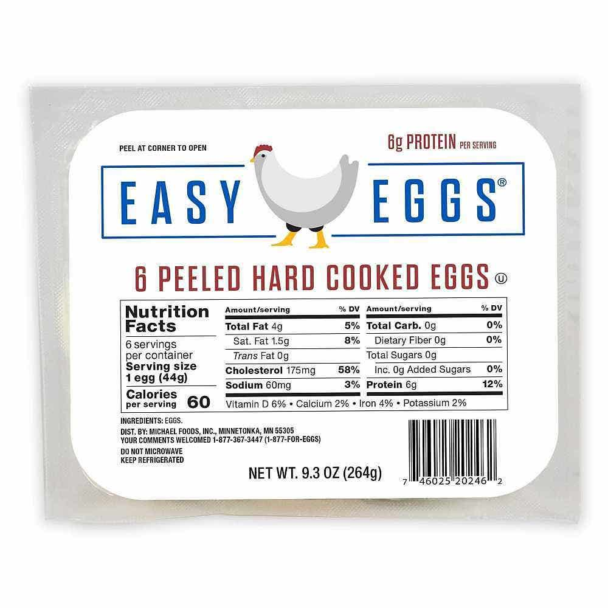
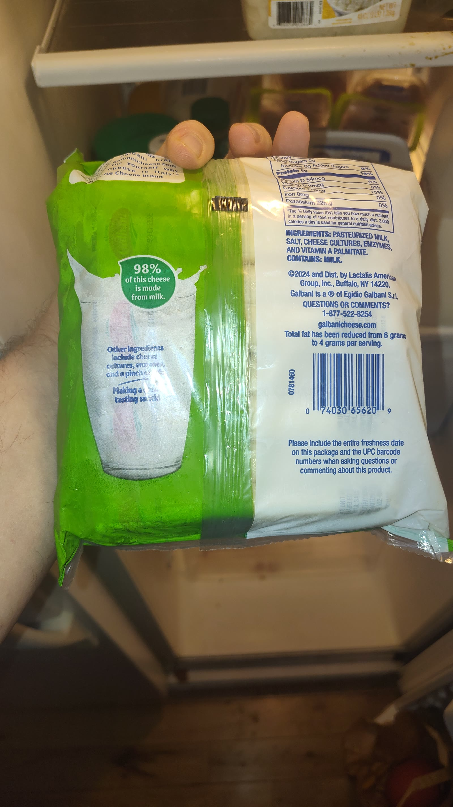
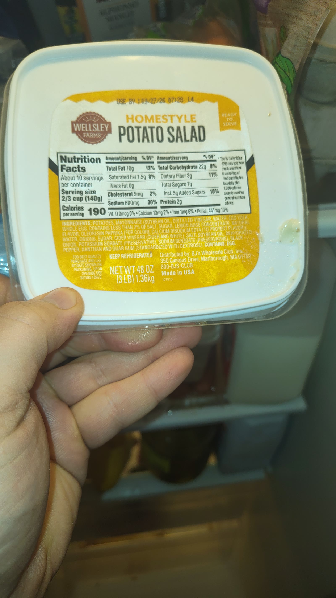
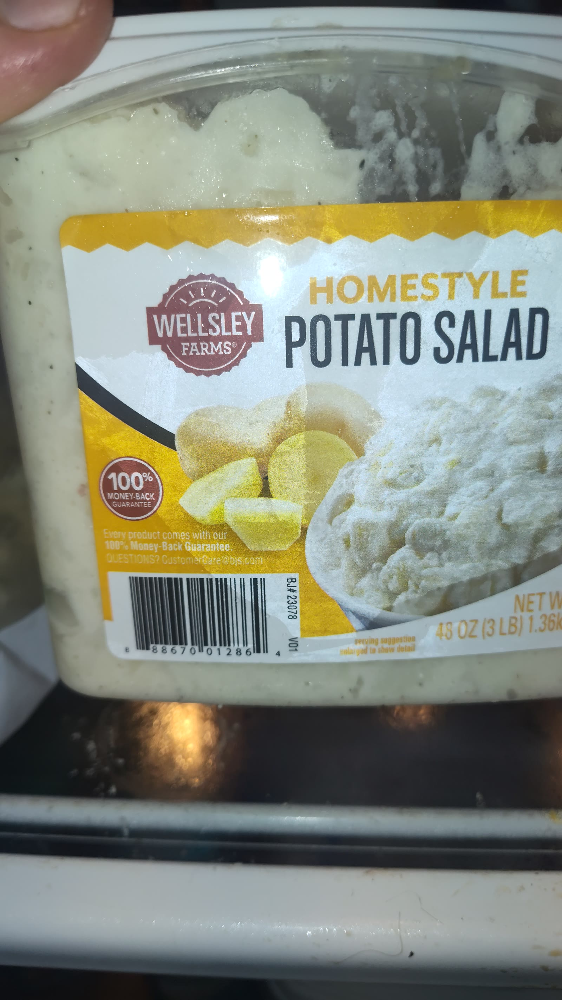
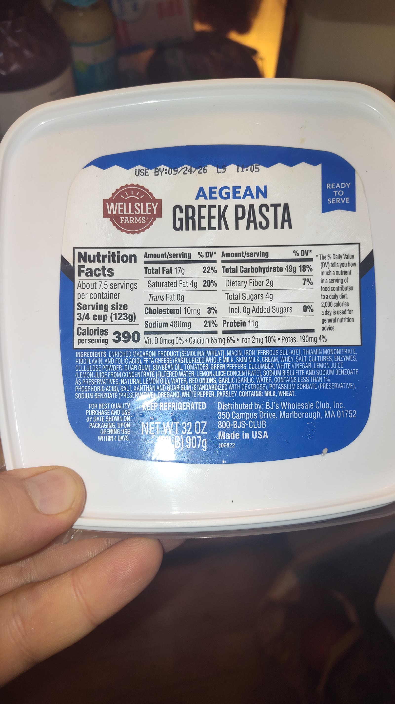
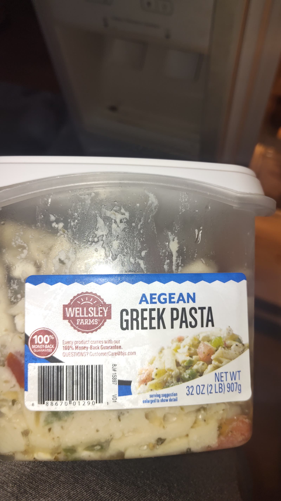
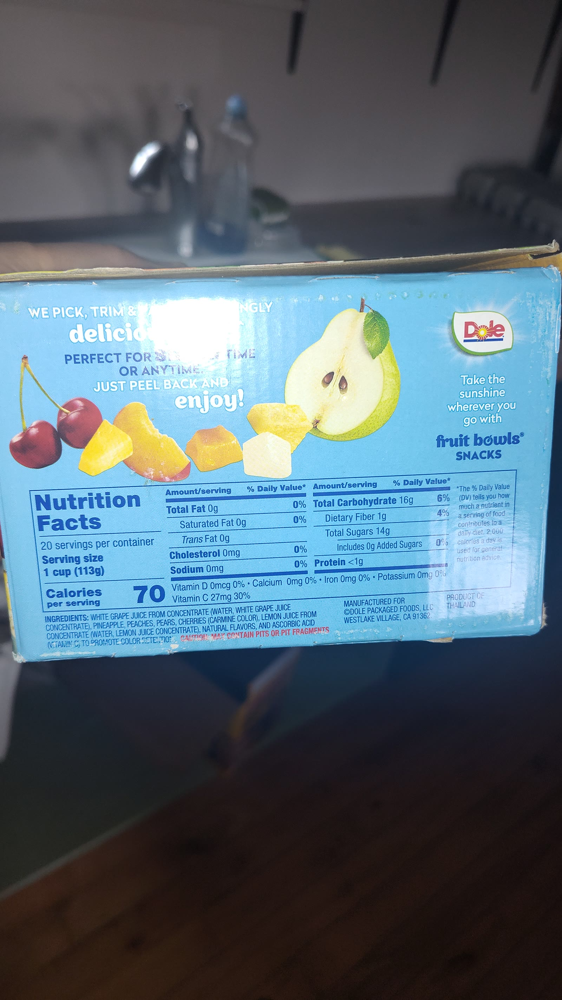
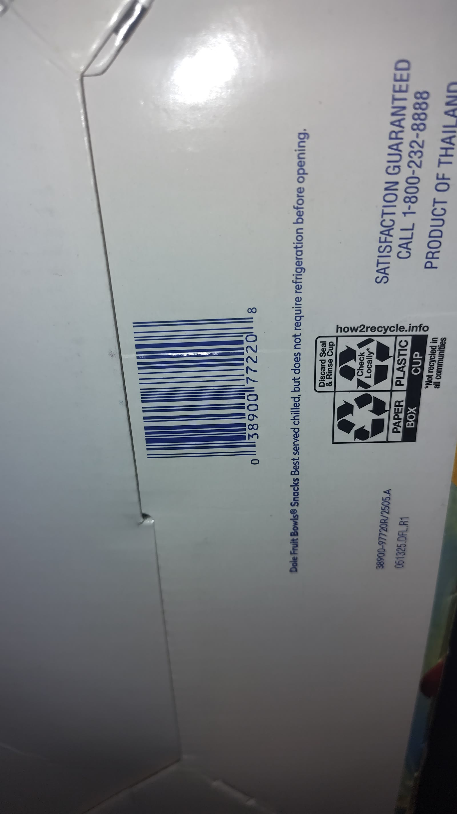
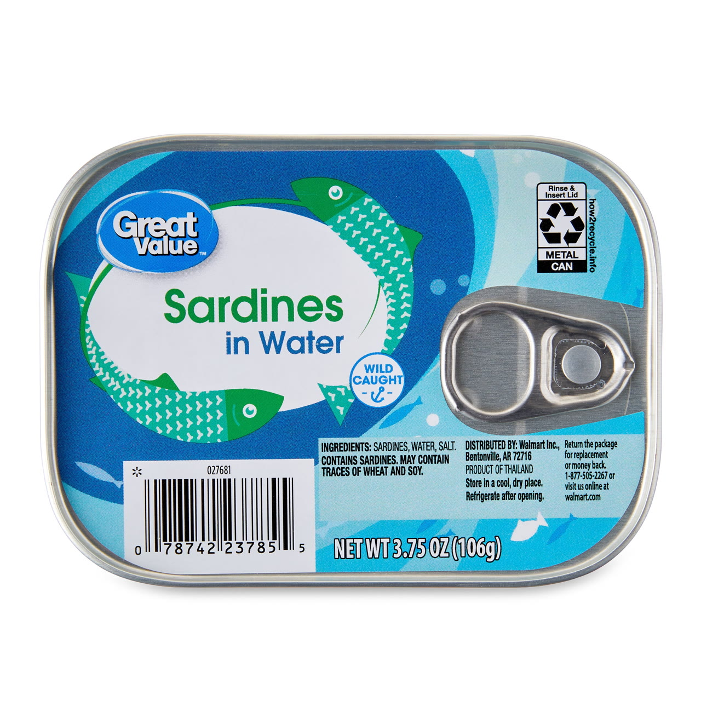
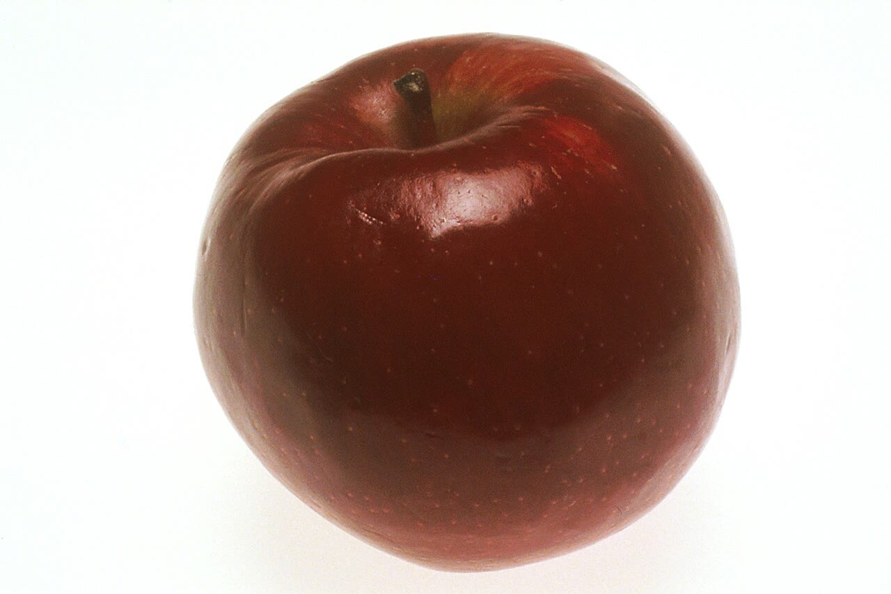

# 2026-09-17

**Timezone:** America/New_York

**Daily goal:** 1500 kcal

**Daily total:** 1385 kcal · Protein 72.5g · Carbs 131g · Fat 64.8g

**Left:** 115 kcal (**7.7%** of goal remaining) · 92.3% used

## Foods logged

| Food | Amount | Barcode | kcal | P | C | F | Photo |
|------|--------|---------|------|---|---|---|-------|
| [Easy Eggs Peeled Hard Cooked Eggs](items/easy-eggs/) | 4 eggs | `046025202462` | 240 | 24 | 0 | 16 | [photo](photos/easy-eggs.jpg) |
| [Galbani Reduced Fat Cheese Sticks](items/galbani-cheese/) | 2 sticks | `074030656209` | 120 | 12 | 0 | 8 | [photo](photos/galbani-cheese.jpg) |
| [Wellsley Farms Homestyle Potato Salad](items/potato-salad/) | 1 serving | `888670012864` | 190 | 2 | 22 | 10 | [photo](photos/potato-salad.jpg) |
| [Wellsley Farms Aegean Greek Pasta](items/aegean-pasta/) | 1 serving | `888670012901` | 390 | 11 | 49 | 17 | [photo](photos/aegean-pasta.jpg) |
| [Dole Fruit Bowls Snacks](items/dole-fruit/) | 2 cups | `038900772208` | 140 | 2 | 32 | 0 | [photo](photos/dole-fruit.jpg) |
| [Great Value Sardines in Water](items/sardines/) | 1 can drained | `078742237855` | 100 | 16 | 0 | 4.5 | [photo](photos/sardines.jpg) |
| [Teriyaki beef stick](items/teriyaki-beef-stick/) | 1 stick | `no_photo` | 110 | 5 | 3 | 9 | — |
| [Apple (bagged)](items/apple/) | 1 medium apple | `888670053638` | 95 | 0.5 | 25 | 0.3 | [photo](photos/apple.jpg) |

## Item details

### [Easy Eggs Peeled Hard Cooked Eggs](items/easy-eggs/)

- **Brand:** Easy Eggs / Michael Foods
- **Amount eaten:** 4 eggs
- **Serving size:** 1 egg (44g)
- **Barcode:** `046025202462`
- **Source:** label
- **Photo:** 

**Nutrition per label/reference serving**

| Nutrient | Amount |
|----------|--------|
| Calories | 60 |
| Protein | 6 g |
| Total carbohydrate | 0 g |
| Total fat | 4 g |
| Dietary fiber | 0 g |
| Total sugars | 0 g |
| Sodium | 60 mg |
| Saturated fat | 1.5 g |
| Cholesterol | 185 mg |
| Added sugars | 0 g |

**Logged for this meal:** 240 kcal · P 24g · C 0g · F 16g

Machine-readable: [`items/easy-eggs/item.json`](items/easy-eggs/item.json)

### [Galbani Reduced Fat Cheese Sticks](items/galbani-cheese/)

- **Brand:** Galbani / Lactalis American Group
- **Amount eaten:** 2 sticks
- **Serving size:** 1 stick
- **Barcode:** `074030656209`
- **Source:** label
- **Photo:** 

**Nutrition per label/reference serving**

| Nutrient | Amount |
|----------|--------|
| Calories | 60 |
| Protein | 6 g |
| Total carbohydrate | 0 g |
| Total fat | 4 g |
| Total sugars | 0 g |

**Logged for this meal:** 120 kcal · P 12g · C 0g · F 8g

Machine-readable: [`items/galbani-cheese/item.json`](items/galbani-cheese/item.json)

### [Wellsley Farms Homestyle Potato Salad](items/potato-salad/)

- **Brand:** Wellsley Farms / BJ's Wholesale Club
- **Amount eaten:** 1 serving
- **Serving size:** 2/3 cup (140g)
- **Barcode:** `888670012864`
- **Source:** label
- **Photo:** 
- **Barcode photo:** 

**Nutrition per label/reference serving**

| Nutrient | Amount |
|----------|--------|
| Calories | 190 |
| Protein | 2 g |
| Total carbohydrate | 22 g |
| Total fat | 10 g |
| Dietary fiber | 3 g |
| Total sugars | 7 g |
| Sodium | 690 mg |
| Saturated fat | 1.5 g |
| Cholesterol | 5 mg |
| Added sugars | 5 g |

**Logged for this meal:** 190 kcal · P 2g · C 22g · F 10g

Machine-readable: [`items/potato-salad/item.json`](items/potato-salad/item.json)

### [Wellsley Farms Aegean Greek Pasta](items/aegean-pasta/)

- **Brand:** Wellsley Farms / BJ's Wholesale Club
- **Amount eaten:** 1 serving
- **Serving size:** 3/4 cup (123g)
- **Barcode:** `888670012901`
- **Source:** label
- **Photo:** 
- **Barcode photo:** 

**Nutrition per label/reference serving**

| Nutrient | Amount |
|----------|--------|
| Calories | 390 |
| Protein | 11 g |
| Total carbohydrate | 49 g |
| Total fat | 17 g |
| Dietary fiber | 2 g |
| Total sugars | 4 g |
| Sodium | 480 mg |
| Saturated fat | 4 g |
| Cholesterol | 10 mg |
| Added sugars | 0 g |

**Logged for this meal:** 390 kcal · P 11g · C 49g · F 17g

Machine-readable: [`items/aegean-pasta/item.json`](items/aegean-pasta/item.json)

### [Dole Fruit Bowls Snacks](items/dole-fruit/)

- **Brand:** Dole
- **Amount eaten:** 2 cups
- **Serving size:** 1 cup (113g)
- **Barcode:** `038900772208`
- **Source:** label
- **Photo:** 
- **Barcode photo:** 

**Nutrition per label/reference serving**

| Nutrient | Amount |
|----------|--------|
| Calories | 70 |
| Protein | 1 g |
| Total carbohydrate | 16 g |
| Total fat | 0 g |
| Dietary fiber | 1 g |
| Total sugars | 14 g |
| Sodium | 0 mg |
| Cholesterol | 0 mg |
| Added sugars | 0 g |

**Logged for this meal:** 140 kcal · P 2g · C 32g · F 0g

Machine-readable: [`items/dole-fruit/item.json`](items/dole-fruit/item.json)

### [Great Value Sardines in Water](items/sardines/)

- **Brand:** Great Value / Walmart
- **Amount eaten:** 1 can drained
- **Serving size:** 1 can drained (74g)
- **Barcode:** `078742237855`
- **Source:** label_lookup
- **Photo:** 

**Nutrition per label/reference serving**

| Nutrient | Amount |
|----------|--------|
| Calories | 100 |
| Protein | 16 g |
| Total carbohydrate | 0 g |
| Total fat | 4.5 g |
| Dietary fiber | 0 g |
| Total sugars | 0 g |
| Sodium | 300 mg |
| Saturated fat | 1.5 g |
| Cholesterol | 75 mg |

**Logged for this meal:** 100 kcal · P 16g · C 0g · F 4.5g

Machine-readable: [`items/sardines/item.json`](items/sardines/item.json)

### [Teriyaki beef stick](items/teriyaki-beef-stick/)

- **Brand:** Unknown (estimated as Jack Link's Teriyaki style)
- **Amount eaten:** 1 stick
- **Serving size:** 1 stick (~0.92 oz / 26g)
- **Barcode:** `no_photo`
- **Source:** estimate

**Nutrition per label/reference serving**

| Nutrient | Amount |
|----------|--------|
| Calories | 110 |
| Protein | 5 g |
| Total carbohydrate | 3 g |
| Total fat | 9 g |
| Total sugars | 2 g |
| Sodium | 390 mg |
| Saturated fat | 4 g |
| Cholesterol | 20 mg |
| Added sugars | 2 g |

**Logged for this meal:** 110 kcal · P 5g · C 3g · F 9g

Machine-readable: [`items/teriyaki-beef-stick/item.json`](items/teriyaki-beef-stick/item.json)

### [Apple (bagged)](items/apple/)

- **Brand:** Wellsley Farms / BJ's Wholesale Club
- **Amount eaten:** 1 medium apple
- **Serving size:** 1 medium apple (~182g) with skin
- **Barcode:** `888670053638`
- **Source:** usda_estimate
- **Photo:** 
- **Photo credit:** Renee Comet — Wikimedia Commons / National Cancer Institute (Public domain (U.S. federal government / NIH))

**Nutrition per label/reference serving**

| Nutrient | Amount |
|----------|--------|
| Calories | 95 |
| Protein | 0.5 g |
| Total carbohydrate | 25.1 g |
| Total fat | 0.3 g |
| Dietary fiber | 4.4 g |
| Total sugars | 18.9 g |
| Sodium | 2 mg |

**Logged for this meal:** 95 kcal · P 0.5g · C 25g · F 0.3g

Machine-readable: [`items/apple/item.json`](items/apple/item.json)

